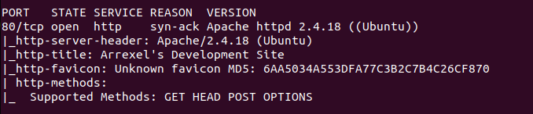
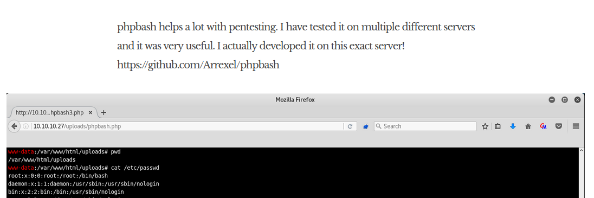
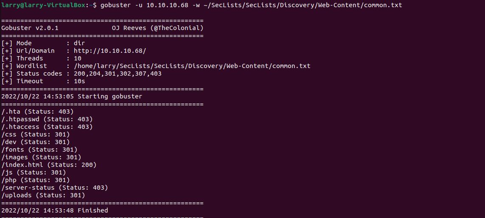
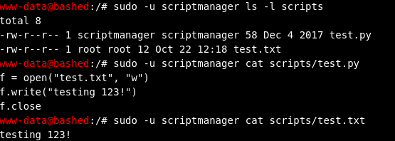
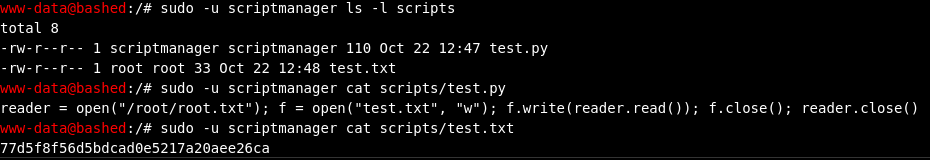

### Larry Liu's Box Writeup | Bashed

## Enumeration

To begin, I ran the following commands to find the open ports and then detailed information about them (its IP was **10.10.10.68**):

```bash
nmap -Pn -n -vv --open -T4 10.10.10.68
nmap -Pn -n -p 80 -vv --open -sV -sC -T4 10.10.10.68
```


From this, I found that it was a website, so I went to it to investigate. In the text blurbs on the server, I noticed how the author wrote that he created the tool on the exact server. I reasoned that it must therefore be stored on the server.



I first tried 10.10.10.68/uploads/phpbash since it was shown in the image, but when that didn't work, I used gobuster to give me a list of every subdirectory.



After trying a few, I found that the author's phpbash script was stored on the /dev directory. Opening it gave me a shell on Bashed.

## Privilege Escalation

I used whoamI to find that I was the www.data user, and then navigated to home where I found the user.txt flag. (61fed49c2ee9d67d1d8bf1aed7cea50d)

Next, I tried to access the root directory, but I did not have the permissions for it. I ran sudo -l to see what commands I was allowed to do, and found that I could run commands as ScriptManager, but ScriptManager didn't have root permissions.


My next step was to look around for things I could use, and I found the Scripts folder, which was out of place. The folder was owned by scriptmanager, so I used `sudo -u scriptmanager ls /scripts/` to take a look at the contents.



I notice that the text file was owned by root and that it was very recently written to, and that the python file writes to the text file. I deduce that root runs the python script on a timer. Knowing this, I replace the python code with the following using tee to retrieve the root file:

```py
reader = open("root/root.txt"); f = open("test.txt", "w"); f.write(reader.read()); f.close(); reader.close()
```

After a bit, the root put the root flag in the test.txt file and I pwned the box!


