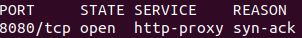
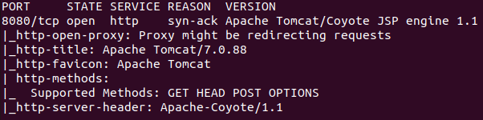
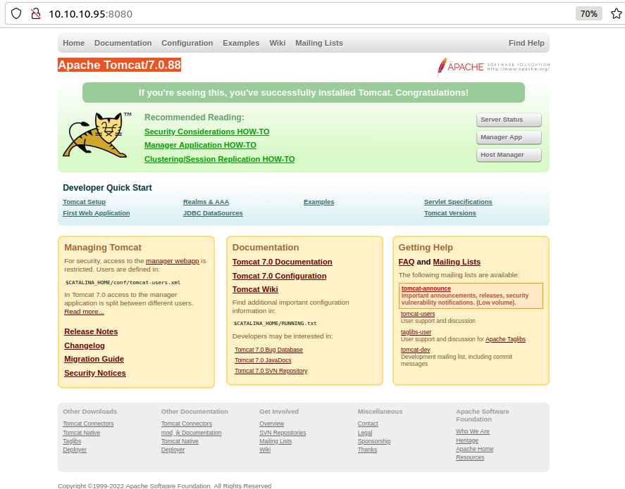
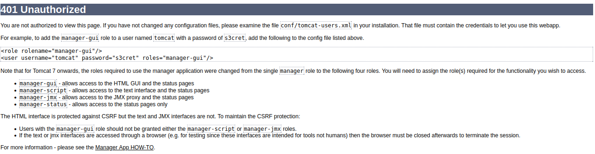
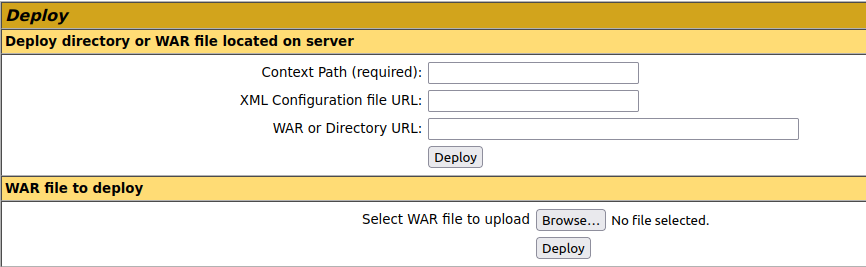
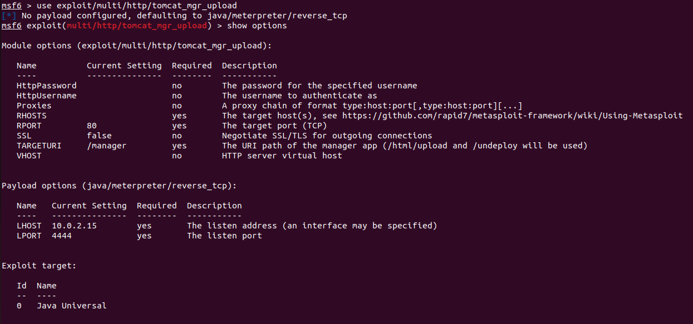
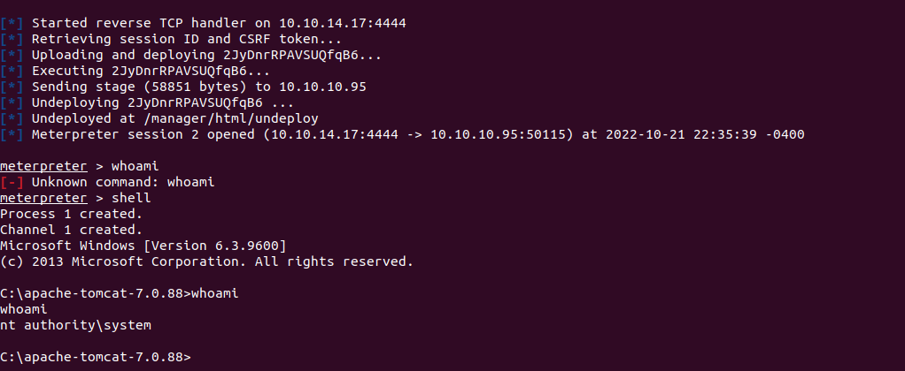
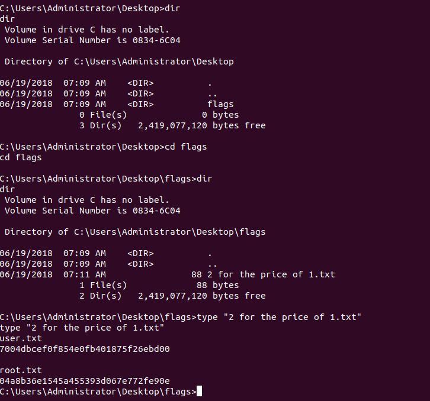

### Larry Liu's Box Writeup | Jerry

Jerry was the first box I attacked and introduced me to the basic mindset and process of pentesting.

## Enumeration

To begin, I ran the following command to quickly scan the ports of the box (its IP was **10.10.10.95**):

```bash
nmap -Pn -n -vv --open -T4 10.10.10.95
```

The command returned one open tcp port at 8080



I then got more detailed information about the port by running:

```bash
nmap -Pn -n -p 8080 -vv --open -sV -sC -T4 10.10.10.95
```


From this, I found that the box was running Apache Tomcat, which I realized was a web application server upon further research.

Since the port was an open port that services http connections, I connected to it directly by putting http://10.10.10.95:8080 in my browser.



From here, I clicked on the manager webapp link, which took me to the following screen after I couldn't log in.



Due to the box's difficulty, I assumed that the default manager login information were the defaults, and used them to log into the manage webapp.



In the management screen, there was a WAR file deployment area. This led me to assume that there were exploits available using this functionality to give attackers remote shells. I searched up "tomcat reverse shell exploit," and found the **exploit/multi/http/tomcat_mgr_upload exploit**.



Using the exploit and putting in the credentials from earlier, I gained access to the machine. From there, I navigated to the Desktop of the admin user and found the flags.




